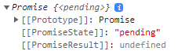
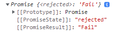
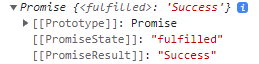

# 프로미스

## 프로미스란?
- 비동기 처리를 위해 콜백 함수를 사용하면 가독성과 에러 처리의 한계 때문에 ES6에서 도입된 비동기 처리 방법이다.
- 프로미스는 비동기처리 상태와 처리결과를 관리하는 객체이다.

## 프로미스 사용방법

- Promise 생성자 함수를 new 연산자로 인스턴스를 생성한다.
- resolve와 reject 함수를 인자로 받는다.
- 비동기 처리가 성공하면 resolve 함수가 호출된다.
- 비동기 처리가 실패하면 reject 함수가 호출된다.
- resolve, reject 함수가 호출되면 프로미스의 상태가 바뀌고 프로미스 객체를 반환한다.
- 프로미스 객체 안에는 프로미스의 상태와 프로미스의 결과값이 저장되어 있다.

**🧩 프로미스의 상태**
| 프로미스 상태 | 상태                                             | 설명                           |
| :----------- | :------------------------------------------------| :----------------------------- |
| pending      | 프로미스 생성자 함수로 인해 인스턴스가 생성된 상태 | 비동기 처리가 수행되지 않은 상태 |
| fulfilled    | 비동기 처리가 성공한 상태                         | resolve 함수를 호출한다.        |
| rejected     | 비동기 처리가 실패한 상태                         | reject 함수를 호출한다.         |

**🧩 pending 상태**

```javascript
const isChecked = true;
// 프로미스 인스턴스 생성
const promise = new Promise((resolve, reject) => {
    // pending 상태를 확인하기 위해 아래코드 주석으로 처리
    // if(isChecked) resolve("Success");
    // else reject("Fail");
});
// 결과 : Promise {<pending>}
console.log(promise);
```

<p align="center">
  
</p>

**🧩 fulfilled 상태**

```javascript
// 성공과 실패 처리를 위한 변수 초기화
const isChecked = true;
const promise = new Promise((resolve, reject) => {
    // 비동기 처리를 성공하도록 조건문으로 실행
    if(isChecked) resolve("Success");
    else reject("Fail");
});
// 결과 : Promise {<fulfilled>: 'Success'}
console.log(promise);
```

<p align="center">
  
</p>

**🧩 rejected 상태**

```javascript
// 성공과 실패 처리를 위한 변수 초기화
const isChecked = false;
const promise = new Promise((resolve, reject) => {
    // 비동기 처리를 실패하도록 조건문 실행
    if(isChecked) resolve("Success");
    else reject("Fail");
});
// 결과 : Promise {<rejected>: 'Fail'}
console.log(promise);
```

<p align="center">
  
</p>

**🔥 조건문으로 처리 과정을 나누지 않으면 함수의 실행 순서대로 프로미스의 상태가 결정 된다.**

```javascript
const promise = new Promise((resolve, reject) => {
    resolve("Success");
    reject("Fail");
});
// 결과 : Promise {<fulfilled>: 'Success'}
console.log(promise);
```

```javascript
const promise = new Promise((resolve, reject) => {
    reject("Fail")
    resolve("Success");
});
// 결과 : Promise {<rejected>: 'Fail'}
console.log(promise);
```

## 프로미스 동기 비동기
프로미스 객체의 작동은 동기적으로 작동하나 프로미스 생성자함수로 만든 인스턴스의 프로토타입 메소드 즉 후속 처리 메소드인 then, catch, finally는 비동기로 작동한다.

```javascript
// 프로미스 객체의 작동은 동기적이다.
console.log(1);
const promise = new Promise((resolve, reject) => {
    console.log(2);
});
console.log(3);
/* 
결과 : 
1
2
3
*/
```

```javascript
console.log(1);
const promise = new Promise((resolve, reject) => {
    resolve(2);
});
// 후속 처리 메소드인 then, catch, finally가 비동기적으로 작동된다.
promise.then((res) => console.log(res));
console.log(3);
/*
결과 : 
1
3
2
*/
```

**💡 프로미스 자체는 동기지만 후속처리 메소드가 비동기적으로 작동함으로 생성자 프로미스함수 콜백안에 비동기를 걸고 rejsolve 상태와 reject 상태를 지정해야한다.** 

```javascript
// setTimeout은 비동기적으로 작동되며 setTimeout안에 변수 num을 resolve에 넘겨준다.
const promise1 = new Promise((resolve, reject) => setTimeout(() => {
    const num = 1;
    resolve(num)
}, Math.random() * 1000));
const promise2 = new Promise((resolve, reject) => setTimeout(() => {
    const num = 2;
    resolve(num)
}, Math.random() * 1000));
const promise3 = new Promise((resolve, reject) => setTimeout(() => {
    const num = 3;
    resolve(num)
}, Math.random() * 1000));
// 1,2,3 출력 보장
promise1
.then((res) => {
    console.log(res);
    return promise2;
})
.then((res) => {
    console.log(res);
    return promise3
})
.then((res) => console.log(res));
```

## 프로미스 처리 메소드
프로미스 객체의 [[PromiseState]]와 [[PromiseResult]] 프로퍼티는 개발자가 접근이 불가능한 내부 프로퍼티로 프로미스의 처리 메소드를 이용해서 개발자가 [[PromiseResult]]에 접근할 수 있다.

- 프로미스 처리 메소드는 모두 비동기로 동작한다.
- 프로미스 처리 메소드의 결과값은 프로미스를 반환한다.
- **🔥 프로미스가 아닌 값을 반환하면 프로미스를 생성해 반환한다.**

**💡 프로미스를 반환하지만 프로미스 객체의 [[PromiseResult]]만 확인이 가능한 상태로 오는 이유는 개발자가 접근이 불가능한 내부 프로퍼티로 사용할 수 있게 바꿔주는 형식인것 같다.**

**📋 Promise.prototype.then("성공 처리 콜백 함수", "실패 처리 콜백 함수")**
- 성공 처리 콜백 함수의 파라미터는 resolve 함수의 결과값을 파라미터로 전달 받는다.
- 실패 처리 콜백 함수의 파라미터는 reject 함수의 결과값을 파라미터로 전달 받는다.

```javascript
const promise = new Promise((resolve, reject) => {
    resolve("Success");
});
// 결과 : Success
promise.then((res) => console.log(res), (err) => console.log(err));
```

```javascript
const promise = new Promise((resolve, reject) => {
    reject("Fail");
});
// 결과 : Fail
promise.then((res) => console.log(res), (err) => console.log(err));
```

**📋 Promise.prototype.catch("실패 처리 콜백 함수")**
- 실패 처리 콜백 함수의 파라미터는 reject 함수의 결과값을 파라미터로 전달 받는다.

```javascript
const promise = new Promise((resolve, reject) => {
    reject("Fail");
});
// 결과 : Fail
promise.catch((err) => console.log(err));
```

**📋 Promise.prototype.finally("무조건 실행하는 콜백 함수")**
- fulfilled, rejected 상태와 상관없이 무조건 콜백 함수를 실행한다.

```javascript
const promise = new Promise((resolve, reject) => {
    resolve("Success");
});
// 결과 : 상태와 상관없이 무조건 실행
promise.finally(() => console.log("상태와 상관없이 무조건 실행"));
```

```javascript
const promise = new Promise((resolve, reject) => {
    reject("Fail");
});
// 결과 : 상태와 상관없이 무조건 실행
promise.finally(() => console.log("상태와 상관없이 무조건 실행"));
```

**👀 then 메소드를 사용해서 성공과 실패 두개의 경우 전부 할 수 있지만 시멘틱적으로 성공은 `then` 실패는 `catch` 공통적으로 처리 할 경우 `finally` 메소드를 사용한다.**

## 프로미스 체이닝
비동기 처리를 위해 콜백 함수를 사용할 경우 가독성의 문제가 있지만 프로미스 체이닝을 사용하면 비동기 처리를 가독성 있게 처리할 수 있다.

- 프로미스 후속 처리 메소드인 then, catch, finally는 언제나 프로미스를 반환함으로 연속해서 프로미스 메소드를 사용할 수 있으므로 연속해서 호출이 가능하다.
- 프로미스 체이닝은 순차적으로 실행된다.
- 프로미스 체이닝으로 사용된 프로미스 처리 메소드의 파라미터는 전 프로미스 처리 메소드의 결과값이다.
- catch 메소드는 rejected 상태가 아니면 호출되지 않는다.

```javascript
// ①
const promise = new Promise((resolve, reject) => {
    resolve("Success");
});

promise
// ②
.then((res) => new Promise((resolve, reject) => resolve("성공")))
// ③
.then((res) => console.log(res))
// ④
.finally(() => console.log("실행 완료"));
```

**📋 코드 동작 원리**   
① 프로미스 생성자 함수를 이용해서 인스턴스를 생성한다.   
② 프로미스 처리 메소드인 then을 사용해서 프로미스를 새롭게 반환한다.   
③ 파라미터 res에는 전 프로미스 처리 메소드의 결과값인 `"성공"`이 저장되어 있다.   
④ 마지막 동작과정인 finally 메소드가 호출되어 `"실행 완료"`를 로그에 출력한다.

## 프로미스 정적 메소드
Promise의 정적 메소드는 5가지를 제공한다.

**📋 Promise.resolve**
- 존재하는 값을 전달하여 resolve하는 프로미스를 생성한다.

```javascript
// fulfilled 상태의 프로미스를 생성한다.
const resolve = Promise.resolve("Success");
// 결과 : Success
resolve.then((res) => console.log(res));
```

**📋 Promise.reject**
- 존재하는 값을 전달하여 reject하는 프로미스를 생성한다.

```javascript
// rejected 상태의 프로미스를 생성한다.
const reject = Promise.reject("Fail");
// 결과 : Fail
reject.catch((err) => console.log(err));
```

**📋 Promise.all**
- 모든 프로미스의 결과를 집계할 때 사용한다. (병렬처리)

```javascript
const data = [];
// resolve가 1의 값을 가지는 프로미스 생성
const promise1 = new Promise((resolve, reject) => {
    setTimeout(() => resolve("1"), Math.random() * 1000);
});
// resolve가 2의 값을 가지는 프로미스 생성
const promise2 = new Promise((resolve, reject) => {
    setTimeout(() => resolve("2"), Math.random() * 1000);
});
// resolve가 3의 값을 가지는 프로미스 생성
const promise3 = new Promise((resolve, reject) => {
    setTimeout(() => resolve("3"), Math.random() * 1000);
});
// 3개의 resolve의 값을 data인 배열에 넣고 확인 (실행 순서 보장 X)
promise1.then((res) => {
    data.push(res);
    console.log(data);
});
promise2.then((res) => {
    data.push(res);
    console.log(data);
});
promise3.then((res) => {
    data.push(res);
    console.log(data);
});
```
위 코드의 문제는 실행 순서도 보장되지 않으며 어떤 프로미스가 마지막에 실행되는지 확인도 불가능하다.   

**🧩 프로미스 체이닝으로 순차적 처리**

```javascript
const data = [];
// resolve가 1의 값을 가지는 프로미스 생성
const promise1 = new Promise((resolve, reject) => {
    setTimeout(() => resolve("1"), Math.random() * 1000);
});
// resolve가 2의 값을 가지는 프로미스 생성
const promise2 = new Promise((resolve, reject) => {
    setTimeout(() => resolve("2"), Math.random() * 1000);
});
// resolve가 3의 값을 가지는 프로미스 생성
const promise3 = new Promise((resolve, reject) => {
    setTimeout(() => resolve("3"), Math.random() * 1000);
});
// return으로 Promise를 넘겨주면서 순서를 보장받는다.
promise1
.then((res) => {
    data.push(res);
    return promise2;
})
.then((res) => {
    data.push(res);
    return promise3;
})
.then((res) => {
    data.push(res);
    // 결과 : [1, 2, 3]
    console.log(data);
});
```
순서를 보장받지만 가독성이 떨어지는 느낌을 받을 수 있다.

**🧩 Promise.all의 사용과 특징**

- 모든 프로미스가 fulfilled 상태여야 하며 rejected 상태가 있는 프로미스가 있으면 즉시 실행를 종료한다.
- 배열의 인덱스로 순서를 보장한다.

```javascript
// resolve가 1의 값을 가지는 프로미스 생성
const promise1 = new Promise((resolve, reject) => {
    setTimeout(() => resolve("1"), Math.random() * 1000);
});
// resolve가 2의 값을 가지는 프로미스 생성
const promise2 = new Promise((resolve, reject) => {
    setTimeout(() => resolve("2"), Math.random() * 1000);
});
// resolve가 3의 값을 가지는 프로미스 생성
const promise3 = new Promise((resolve, reject) => {
    setTimeout(() => resolve("3"), Math.random() * 1000);
});
// 순서를 보장하며 가독성도 확보할 수 있다.
Promise.all([promise1, promise2, promise3])
// 결과 : [1, 2, 3]
.then((res) => console.log(res));
```

```javascript
// resolve가 1의 값을 가지는 프로미스 생성
const promise1 = new Promise((resolve, reject) => {
    setTimeout(() => resolve("1"), Math.random() * 1000);
});
// reject가 Error의 값을 가지는 프로미스 생성
const promise2 = new Promise((resolve, reject) => {
    setTimeout(() => reject("Error"), Math.random() * 1000);
});
// resolve가 3의 값을 가지는 프로미스 생성
const promise3 = new Promise((resolve, reject) => {
    setTimeout(() => resolve("3"), Math.random() * 1000);
});
// 한개의 프로미스라도 rejected 상태라면 catch로 확인할 수 있으며 실행은 종료된다.
Promise.all([promise1, promise2, promise3])
.then((res) => console.log(res))
// 결과 : Error
.catch((err) => console.log(err));
```

**🧩 Promise.all의 오류 해결 방법**

- 배열에 인자로 넘겨줄 때 catch를 사용해서 값을 전달 받으면 프로미스는 자동으로 프로미스를 생성해서 반환하는 특성을 사용한다.

```javascript
// resolve가 1의 값을 가지는 프로미스 생성
const promise1 = new Promise((resolve, reject) => {
    setTimeout(() => resolve("1"), Math.random() * 1000);
});
// reject가 Error의 값을 가지는 프로미스 생성
const promise2 = new Promise((resolve, reject) => {
    setTimeout(() => reject("Error"), Math.random() * 1000);
});
// resolve가 3의 값을 가지는 프로미스 생성
const promise3 = new Promise((resolve, reject) => {
    setTimeout(() => resolve("3"), Math.random() * 1000);
});
// catch를 사용해서 rejected 상태가 발생하면 그 값을 반환하여 fulfilled 상태로 바꿔서 출력하는 방식
Promise.all([promise1, promise2.catch((err) => err), promise3])
// 결과 : [ '1', 'Error', '3' ]
.then((res) => console.log(res))
// catch가 실행되지 않는다.
.catch((err) => console.log(err));
```

**📋 Promise.allSettled**

- 모든 프로미스의 상태의 값을 모아서 반환한다.
- rejected 상태의 프로미스를 만나도 정지하지 않는다.

```javascript
// resolve가 1의 값을 가지는 프로미스 생성
const promise1 = new Promise((resolve, reject) => {
    setTimeout(() => resolve("1"), Math.random() * 1000);
});
// reject가 Error의 값을 가지는 프로미스 생성
const promise2 = new Promise((resolve, reject) => {
    setTimeout(() => reject("Error"), Math.random() * 1000);
});
// resolve가 3의 값을 가지는 프로미스 생성
const promise3 = new Promise((resolve, reject) => {
    setTimeout(() => resolve("3"), Math.random() * 1000);
});

Promise.allSettled([promise1, promise2, promise3])
/*
결과 : 
[
  { status: 'fulfilled', value: '1' },
  { status: 'rejected', reason: 'Error' },
  { status: 'fulfilled', value: '3' }
]
*/
.then((res) => console.log(res));
```

**📋 Promise.race**

- 모든 프로미스의 상태를 기다리는 것이 아니고 가장 먼저 fulfilled 상태의 프로미스를 결과값을 반환한다.
- 프로미스의 상태중 rejected와 fulfilled 상태가 동시에 존재하면 먼저 실행이 끝난 상태의 결과값을 반환한다.

```javascript
// resolve가 1의 값을 가지는 프로미스 생성
const promise1 = new Promise((resolve, reject) => {
    setTimeout(() => resolve("1"), Math.random() * 1000);
});
// resolve가 2의 값을 가지는 프로미스 생성
const promise2 = new Promise((resolve, reject) => {
    setTimeout(() => resolve("2"), Math.random() * 1000);
});
// resolve가 3의 값을 가지는 프로미스 생성
const promise3 = new Promise((resolve, reject) => {
    setTimeout(() => resolve("3"), Math.random() * 1000);
});
// race 시작
Promise.race([promise1, promise2, promise3])
// 함수의 실행이 제일 빨리 종료된 fulfilled 값이 출력
.then((res) => console.log(res));
```

```javascript
// resolve가 1의 값을 가지는 프로미스 생성
const promise1 = new Promise((resolve, reject) => {
    setTimeout(() => resolve("1"), Math.random() * 1000);
});
// resolve가 2의 값을 가지는 프로미스 생성
const promise2 = new Promise((resolve, reject) => {
    setTimeout(() => resolve("2"), Math.random() * 1000);
});
// rejected가 Error 값을 가지는 프로미스 생성
const promise3 = new Promise((resolve, reject) => {
    setTimeout(() => reject("Error"), Math.random() * 1000);
});
// race 시작
Promise.race([promise1, promise2, promise3])
// 함수의 실행이 제일 빨리 종료된 fulfilled, rejected가 실행
.then((res) => console.log("fulfilled", res))
.catch((err) => console.log("rejected", err));
```

**💡 Promise.race 프로퍼티는 순서가 보장되는 것도 아니고 빨리 실행이 완료된 프로미스 하나를 반환하기 때문에 사용을 많이 하지는 않을 것 같다.**