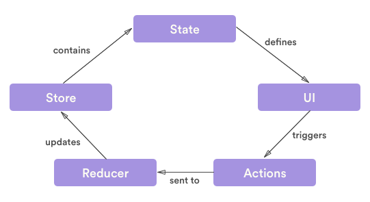

# redux

## 📌 redux란?

저장소에서 데이터를 읽고 저장소에 작업을 전달하여 상태를 업데이트 할 수 있게 해주는 라이브러리이다. (전역 상태관리를 위한 라이브러리)

## 📌 redux의 3원칙

- Single source of truth : 하나의 스토어를 가지고 있어야한다.
- State is read-only : 읽기 전용이기 때문에 상태를 직접 변경시키면 안된다. (action)
- Changes are made with pure functions : 상태의 변경은 순수함수로만 변경이 가능하다. (reducer)

## 📌 redux의 구성요소

<p align="center">

</p>

### 🧩 action
`type`프로퍼티를 필수적으로 가지고 있어야하며 상태를 바꾸는 정보를 담고있는 객체이다.

```javascript
// action
const addCounter = () => {
    return { type: "ADD_COUNTER" }
}
```

### 🧩 reducer 
- 상태를 직접 변경시키는 함수이며 액션의 정보를 받아 새로운 상태를 반환한다.
- reducer의 첫 번째 요소는 state를 담고 있으며 두 번째 요소는 action 객체를 가지고 있다.
- state의 default 값을 설정해야 한다.

```javascript
// reducer
const counterReducer = (state = 0, action) => {
    const { type = '', payload = 0 } = action;
    switch (type) {
        case ADD_COUNTER:
        return state + 1;
        case MINUS_COUNTER:
        return state - 1;
        case CHANGE_COUNTER:
        return payload;
        default:
        return state;
    }
};
```

### 🧩 store
상태와 리듀서가 들어가있다. (저장소)

```javascript
// store
import { createStore } from 'redux'
import { counterReducer } from './store/index';

const store = createStore(counterReducer);
```

### 🧩 subscribe 
- 스토어에서 상태를 가져오는 함수이다. (구독)
- 함수형 컴포넌트에서는 useSelector를 사용한다.
- useSelector의 첫 번째 요소는 스토어의 state를 가져온다.

```javascript
// subscribe
import React from "react";
import { useSelector } from 'react-redux';

function App() {
    // useSelector의 첫 번째 요소는 스토어의 state를 가져온다.
    const counter = useSelector((state) => state);

    return (
        <React.Fragment>
            <span>{counter}</span>
        </React.Fragment>
    );
}

export default App;
```

### 🧩 dispatch
- 액션을 발생시키는 함수이다.
- 함수형 컴포넌트에서는 useDispatch를 사용한다.
- useDispatch는 함수를 반환하며 그 반환한 함수에 객체를 넣어준다.

```javascript
// dispatch
import React from "react";
import { useSelector, useDispatch } from 'react-redux';

function App() {
    const counter = useSelector((state) => state);
    const dispatch = useDispatch();
    // action 함수
    const addCounter = () => {
        return { type: "ADD_COUNTER" }
    }
    // dispatch에 액션 객체 넘겨주면 액션을 발생시킨다
    const handleOnClick = () => {
        dispatch(addCounter());
    }

    return (
        <React.Fragment>
            <span>{counter}</span>
            <button onClick={handleOnClick}>+1</button>
        </React.Fragment>
    );
}

export default App;
```

## 📌 store를 나눠서 관리하기

- reducer를 각자 관리할 수 있어서 가독성과 유지보수성이 좋아진다.
- combineReducers 메소드를 사용한다.

```javascript
import { createStore, combineReducers } from 'redux';
import { counterReducer, counterAction } from './counterReducer';
import { listReducer, listAction } from './listReducer';
// combineReducers 메소드에 객체를 파라미터로 넣어준다.
const root = combineReducers({
    counter: counterReducer,
    list: listReducer
});
// combineReducers를 단일 스토어로 생성한다.
const store = createStore(root);

export { store, counterAction, listAction };
```

### 🧩 연결된 store를 사용하는 방법

```javascript
import React from "react";
import { useSelector, useDispatch } from 'react-redux';
import { counterAction } from '../src/store/counterReducer';

function App() {
    const counter = useSelector((state) => state.counter);
    const dispatch = useDispatch();

    const handleOnClick = () => {
        dispatch(counterAction.addCounter());
    }

    return (
        <React.Fragment>
            <span>{counter}</span>
            <button onClick={handleOnClick}>+1</button>
        </React.Fragment>
    );
}

export default App;
```

## 📌 redux Ducks 구조
- Action Type과 Action 그리고 Reducer를 따로 관리하는데 그걸 하나의 파일로 관리해서 모듈화 하는 방법이다.
- 유지보수와 가독성이 좋아진다.

```javascript
// actions
const ADD_COUNTER = "ADD_COUNTER";
const MINUS_COUNTER = "MINUS_COUNTER";
const CHANGE_COUNTER = "CHANGE_COUNTER";

// action creators
const counterAction = {
    addCounter: () => ({ type: ADD_COUNTER }),
    minusCounter: () => ({ type: MINUS_COUNTER }),
    changeCounter: (item) => ({ type: CHANGE_COUNTER, payload: item })
};

// reducer
const counterReducer = (state = 0, action) => {
    const { type = '', payload = 0 } = action;
    switch (type) {
        case ADD_COUNTER:
        return state + 1;
        case MINUS_COUNTER:
        return state - 1;
        case CHANGE_COUNTER:
        return payload;
        default:
        return state;
    }
};

export { counterReducer, counterAction };
```